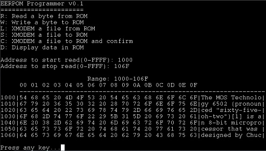

# MSP430-based EEPROM programmer

This is a programmer for EEPROM memory chips in DIP28 package. The programmer connects to a PC over a virtual COM port using an FT232 at 230.4k baud. The firmware of the programmer supports the following commands over serial:

R: Read a byte from ROM  
W: Write a byte to ROM  
L: XMODEM a file from ROM  
S: XMODEM a file to ROM  
C: XMODEM a file to ROM and confirm  
D: Display data in ROM  
P: Page write settings  

